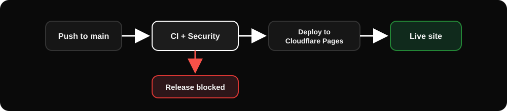
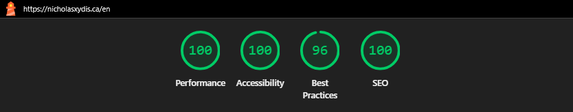
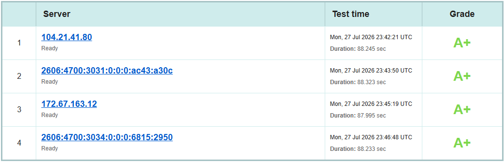
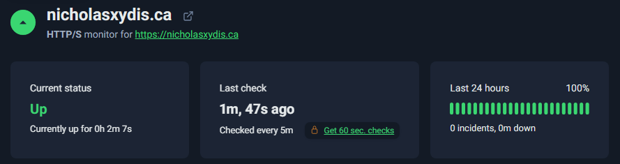

<div align="center">

# Nicholas Xydis | Portfolio

[](https://git.io/typing-svg)

A bilingual personal portfolio built to showcase my work, case studies, and engineering practices.

<br>

<p align="center">
  
  &nbsp;&nbsp;
  
  &nbsp;&nbsp;
  
  &nbsp;&nbsp;
  
  &nbsp;&nbsp;
  
  &nbsp;&nbsp;
  
</p>

<p align="center">
  <strong>English + French</strong> &nbsp;|&nbsp;
  <strong>217 automated tests</strong> &nbsp;|&nbsp;
  <strong>Lighthouse 90+</strong>
</p>

<p align="center">
  
  &nbsp;
  
  &nbsp;
  
</p>

<a href="https://nicholasxydis.ca">
  
</a>

</div>

## Features

- **Bilingual:** Complete English and French routes with a language toggle that keeps you on the same page and preserves your place.
- **Case studies:** A dedicated page for each project, with the story, the tech, and links to the live site and source.
- **SEO:** Clean titles, canonical URLs, language alternates, social share cards, and a generated sitemap so every page is discoverable.
- **Motion:** Smooth page transitions and scroll effects that respect a visitor's reduced-motion preference.
- **Resilience:** A friendly bilingual 404 page and an error boundary so an unexpected failure never shows a blank screen.

## Architecture

```text
Portfolio/
├─ src/
│  ├─ components/     Shared UI primitives (Seo, ErrorBoundary, icons, motion helpers)
│  ├─ content/         Zod schemas + JSON content (projects, experience, education, stack)
│  ├─ features/        Page sections (project-list, experience-list, education-list, contact, tech-stack)
│  ├─ hooks/           useLocale, useScrollRestoration, usePageViews, and other shared hooks
│  ├─ lib/             i18n, SEO metadata, analytics, dates, and other utilities
│  ├─ locales/         English and French translation dictionaries
│  ├─ routes/          HomePage, ProjectDetailPage, NotFoundPage, LocaleLayout
│  └─ test/            Shared test render helpers
├─ e2e/                Playwright navigation, accessibility, responsive, and SEO specs
├─ scripts/            Content validation and sitemap generation scripts
└─ .github/workflows/  CI, security, and production deploy workflows
```

<div align="center">
<pre>
┌─────────────────────────────────────────────────────────┐
│                     Visitor Browser                     │
│      Bilingual UI, SEO metadata, PostHog analytics      │
└────────────────────────────┬────────────────────────────┘
                             │ HTTPS
┌────────────────────────────▼────────────────────────────┐
│                  Cloudflare Pages Edge                  │
│    Global CDN, TLS, static asset serving, redirects     │
└────────────────────────────┬────────────────────────────┘
                             │ Build artifact
┌────────────────────────────▼────────────────────────────┐
│                    Vite Static Build                    │
│         Localized HTML, CSS, JavaScript, assets         │
└─────────────────────────────────────────────────────────┘
</pre>
</div>

## Tech Stack

| Area     | Stack                                         |
| -------- | --------------------------------------------- |
| Frontend | React 19, TypeScript, Tailwind CSS, Vite      |
| Testing  | Vitest, Testing Library, Playwright           |
| DevOps   | GitHub Actions, Cloudflare Pages, UptimeRobot |

## Testing

| Suite                  |   Count | Tools                                           |
| ---------------------- | ------: | ----------------------------------------------- |
| Unit / component tests |     123 | Vitest, Testing Library                         |
| End-to-end checks      |      94 | Playwright, axe-core, desktop + mobile Chromium |
| **Total**              | **217** | CI-enforced                                     |

End-to-end coverage includes automated accessibility scans against WCAG 2.1 A/AA on every public route, the 404 page, and both locales.

## CI/CD

| Workflow          | File                                      | Purpose                                                                           |
| ----------------- | ----------------------------------------- | --------------------------------------------------------------------------------- |
| CI                | `.github/workflows/ci.yml`                | Format, lint, typecheck, unit tests + coverage, build, Playwright E2E, Lighthouse |
| Security          | `.github/workflows/security.yml`          | CodeQL and dependency review                                                      |
| Deploy Production | `.github/workflows/deploy-production.yml` | Build and publish to Cloudflare Pages                                             |

<div align="center">
  
</div>

Lighthouse CI enforces a minimum score of 90 across Performance, Accessibility, Best Practices, and SEO on every push. Any required check failing blocks the release.

## Quality Gates

### Lighthouse

<p align="center">
  
  &nbsp;
  
  &nbsp;
  
  &nbsp;
  
</p>

<div align="center">
  
</div>

<!-- TODO: add docs/screenshots/lighthouse.png -->

### SSL Labs

<p align="center">
  
</p>

<div align="center">
  
</div>

<!-- TODO: add docs/screenshots/ssl-report.png -->

**Grade A+** across all four Cloudflare edge servers (IPv4 and IPv6).

### Uptime Monitoring

<p align="center">
  
</p>

<div align="center">
  
</div>

**External monitoring:** UptimeRobot checks the production site every five minutes — **100% availability, zero incidents**.

<!-- TODO: add docs/screenshots/uptime-robot.png -->

## License

Copyright © 2026 Nicholas Xydis. All rights reserved.

This repository and its contents are made available for viewing purposes only. See the [license](LICENSE) for the complete terms.
